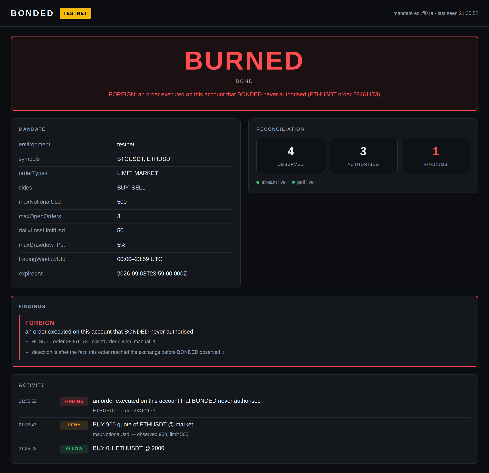

# BONDED

**Going around BONDED is possible. Going around it unnoticed is not.**

An AI agent trading a Binance account gets no credential of its own — only a mandate. Every
order that reaches the exchange is reconciled against what BONDED actually authorised, so an
order it never approved is detected, attributed, and burns the bond.

Built for the **Binance Agent OS Mini Hackathon**, Track A (Agent Workflows → Trading
Workflows). Deadline **2026-09-08 23:59 UTC**.

---

## The problem

Binance ships two ways for an AI agent to trade your account, and they have very different
security postures:

| Path | Guarded? |
| --- | --- |
| **MCP Server** (`agent.binance.com/mcp/agentic`) | Yes — dedicated Agentic sub-account, withdrawal scope never available, **every trade confirmed by you first** |
| **Skills Hub / `binance-cli`** | **No** — takes raw `BINANCE_API_KEY` / `BINANCE_SECRET_KEY`, no confirmation step |

Binance guarded the path where a human approves every trade. It did not guard the path where
an agent holds your API keys directly — and that is the path every agent framework actually
uses, because it is the one that runs unattended.

BONDED guards that one.

## Built on Agent OS

Every surface below is one Agent OS ships. What is real, and checkable:

| Agent OS surface | How BONDED uses it |
| --- | --- |
| **Skills Hub** | BONDED is packaged as an Agent OS skill — [`SKILL.md`](./SKILL.md) at the repository root, with the submission prepared in [`contrib/binance-skills-hub/`](./contrib/binance-skills-hub) |
| **`@binance/binance-cli`** | A runtime dependency, in `package.json`. Reference prices can be read through Binance's own CLI: set `BONDED_PRICE_SOURCE=binance-cli` |
| **MCP** | BONDED *is* an MCP server, over stdio, so any MCP client can hold it |
| **Binance MCP server** | Runs alongside it — Binance's server for market data, BONDED for orders. See [Connecting an agent](#running-it) |

And what it deliberately does **not** do: orders are signed by BONDED itself, against Spot
REST, not shelled out to the CLI. The gate has to control the exact query string it signs
and stamp an unforgeable `clientOrderId` on every order, so putting a process boundary in
the signing path would cost the guarantee and buy nothing. That reasoning is about the
write path; reads have no such constraint, which is why the price source can be the CLI.

One honest note on Binance's hosted MCP server, recorded so nobody repeats the
experiment: it answers `401` to an unauthenticated `initialize`, so the "market data needs
no auth" scope still sits behind an interactive OAuth consent, and it has no testnet. An
unattended server cannot complete a browser consent flow, so BONDED composes with it at
the agent's level — both servers registered side by side — rather than calling it.

## What it does

1. **Holds the credential.** The agent talks to BONDED's MCP server, never to Binance. It has
   no key of its own.
2. **Gates every order** against a mandate it cannot read — symbol allowlist, max notional,
   leverage ceiling, drawdown, trading window. Denials are sub-millisecond and name the exact
   clause that fired.
3. **Reconciles what actually happened.** Binance's user data stream reports every order on
   the account — *including ones BONDED never authorised*. An unexplained order is a bypass:
   the bond burns and trade scope is revoked.

Point 3 is the one nobody else has built. A gate is blind to anything that goes around it, so
BONDED keeps a second, independent account of reality and treats disagreement as the finding.

Five outcomes, and the differences matter:

| Outcome | Meaning |
| --- | --- |
| `AUTHORISED` | An order BONDED allowed, executed exactly as authorised |
| `MISMATCHED` | Authorised — but the order that executed is not the one authorised |
| `FOREIGN` | No BONDED identifier at all. A plain bypass |
| `FORGED` | Wears BONDED's namespace without a valid tag — worse than foreign |
| `UNKNOWN_AUTHENTIC` | Tag verifies, no matching record. A log-integrity problem |

Anything but the first burns the bond and revokes trade scope. Every finding ships with a
plain explanation, the verbatim evidence, a Binance order id anyone can check independently,
and an explicit list of what could **not** be determined.

## Honest limits

Every one of these is a real weakness. They are here rather than buried because a security
design that does not name its own limits has not been examined, and because each is
something a careful reader would find in ten minutes anyway.

### The bound rests on key custody

BONDED is **not a TEE and not a ZK circuit**. It holds the Binance credential and the agent
does not, which is what makes the bound structural rather than advisory — but compromise the
machine BONDED runs on and the bound is gone. On the ladder of enforcement mechanisms this
is the middle rung: a signed mandate with a public trace. The rungs above it need attested
hardware or a ZK-native chain, and neither was reachable here.

### Reconciliation detects; it does not prevent

A bypass order reaches the exchange and fills **before** BONDED sees it. What BONDED
guarantees is that it will not go unnoticed: the order is attributed, the bond burns, and
scope is revoked so nothing further can be placed through the gate. Deterrence plus
attribution, not prevention. Every `FOREIGN` finding says exactly this in its own
uncertainty list, on screen, in the demo.

### It audits compliance, not quality

The gate can prove an order was inside the mandate. It has no opinion on whether the trade
was sensible, and it cannot acquire one. An agent that loses money strictly within its
limits is a mandate problem, not a BONDED problem.

### Why this runs on testnet, deliberately

Not a limitation worked around — a choice, and it would be the same choice with more time.

**The demo places an order that defeats a safety control.** That is the whole argument:
an order goes around BONDED, fills, and is caught. On mainnet that is real money being
deliberately misused on camera, repeatedly, across takes. A security tool whose
demonstration requires misusing a funded account has not thought about what it is asking
its audience to do.

The code enforces this rather than trusting the operator to remember it. BONDED refuses
to start against production unless `BONDED_ALLOW_PROD=1` is set explicitly, and the two
scripts that exist to defeat it — `scripts/bypass-order.mjs` and `scripts/redteam.mjs` —
refuse production **with no override at all**.

It also happens to be the only place the argument can be made. Binance's hosted MCP
server has no testnet: it trades a funded Agentic sub-account on mainnet, over OAuth,
with a human confirming every trade. That path is already guarded, and BONDED has
nothing to add to it. The path BONDED does guard — raw API keys, no confirmation, which
is what an unattended agent runs on — is the one that has a testnet. `binance-cli`,
Binance's own Agent OS tooling and now a dependency here, supports `testnet` alongside
`prod` and `demo` for exactly this reason.

What testnet costs is listed honestly below: the withdrawal guard cannot run there, and
fills are simulated.

### The withdrawal guarantee is not verified on testnet

BONDED does not implement a withdrawal guard — it verifies the exchange enforces one, which
is stronger, because that guarantee survives BONDED being wrong about everything else. But
`GET /sapi/v1/account/apiRestrictions` does not exist on Spot Testnet, so on testnet the
guard reports `WARN` and states that it asserted `BINANCE_API_ENV=testnet` instead. It does
not report a pass it did not earn.

### Two loss limits, and what they mean

`dailyLossLimitUsd` is absolute; `maxDrawdownPct` is the same loss as a percentage of the
account's quote-asset balance. Whichever is tighter fires first. Both compare against
**realised** PnL computed with an average cost basis from Binance's own trade history —
the definition is stated in full in `src/domain/pnl.ts`, because an undefined risk metric
is worse than none.

Positions opened before the seven-day basis window have no known cost here. Selling one
realises an unknown amount, so that quantity is excluded from the figure and reported
rather than guessed at. The limits therefore **understate** activity in that case; they
never overstate it.

### The gate is only as good as the mandate

A mandate that compiles to weaker rules than the owner intended fails silently — nothing
downstream can detect the difference between "permitted" and "permitted by mistake". The
mitigations are human: clauses render as numbered text before anything runs, and an
unrecognised clause name is a hard error rather than an ignored key.

### Testnet fills are not real fills

Testnet liquidity does not resemble production. No PnL figure produced here means anything,
and none is presented as if it does.

### Detection is only as wide as the stream

`GET /api/v3/allOrders` requires a symbol — there is no account-wide REST listing — so the
polling backstop only ever sees the symbols it was given. **The user data stream is the
only account-wide source.** With it down, an order on a symbol the mandate never named
cannot be observed at all.

BONDED treats that as a loss of the audit path rather than a degraded one: without an
account-wide source, trading stops. `BONDED_ALLOW_PARTIAL_AUDIT=1` accepts symbol-scoped
coverage and keeps trading, and the boot banner says which of the two is in force.
`BONDED_WATCH_SYMBOLS` widens the poller beyond the mandate's own symbols.

**As of 2026-09-06 that is not a hypothetical.** Binance removed the listen-key REST
endpoints in February 2026: `POST /api/v3/userDataStream` now answers **410 Gone** on
Spot Testnet, verified on a real machine. The account-wide source is therefore
unavailable, and BONDED refuses to start unless `BONDED_ALLOW_PARTIAL_AUDIT=1` says
symbol-scoped coverage is acceptable — which is the guard behaving exactly as designed,
refusing to trade with less observation than it claims.

The replacement is `POST /sapi/v1/userListenToken` plus
`userDataStream.subscribe.listenToken` over the WebSocket API. It is not implemented
here. Until it is, run with:

```
BONDED_ALLOW_PARTIAL_AUDIT=1
BONDED_POLL_INTERVAL_MS=5000
```

Detection then comes from polling the mandate's symbols every three seconds instead of
from the stream — slower, and blind to symbols outside the mandate, which is precisely
what the WARN on the banner says.

A mid-session stream loss that still leaves the poller healthy degrades detection from
near-instant to one polling interval, for the symbols the poller covers.

### Aggregate limits bind against a snapshot, not against the exchange's clock

The order path is serialised, and orders placed since the current account observation
count toward `maxOpenOrders`, so a burst cannot slip several orders through one stale
count. That closes the concurrency hole; it does not make the caps instantaneous.

`dailyLossLimitUsd` and `maxDrawdownPct` compare against **realised** PnL derived from
trade history that is refreshed on a 30-second budget. A loss is only realised when a
position closes, and BONDED learns of it when the snapshot refreshes. So a fast sequence
of losing trades can breach a loss limit and keep trading until the next refresh sees it.
This is inherent to enforcing a limit against an exchange that fills orders without
asking, and it is a lag, not a hole: the cap binds as soon as the loss is observable.

Positions that stay open are not counted at all — that is what "realised" means.

### What has not been exercised against a live exchange

Development ran in an environment Binance geo-blocks, so signing and order placement are
covered by tests against a stubbed exchange rather than a real one.

The boot path **has** now been run against live Spot Testnet, and two things came back
from it. The guards pass — environment, mandate, clock skew, symbol grounding against
live `exchangeInfo`, audit path — and the clock-skew guard caught a real 113-second drift
on the machine it ran on, before anything was signed. And the listen-key flow is **gone**:
`POST /api/v3/userDataStream` answers 410, as described above. What remains unverified is
an order actually reaching the matching engine and coming back through reconciliation.

## Status

**The reconciler works end to end.** The full sequence — allow, refuse, bypass, detect,
revoke — is covered by an integration test against a stubbed exchange.

| Component | State |
| --- | --- |
| Mandate compiler, content addressing, `exchangeInfo` grounding | done |
| Pre-trade gate — 17 clauses, pure, fail-closed | done |
| Realised PnL from trade history — the figure the loss limits bind on | done |
| Hash-chained decision log with tamper detection | done |
| Binance Spot REST client — signing, timeouts, bounded retries | done |
| MCP server — `place_order`, `check_order`, `cancel_order`, `get_mandate_summary`, `get_account` | done |
| Boot guards + startup banner | done |
| **Reconciler — authorisation index, classification, bond burn** | **done** |
| Order sources — polling backstop + user data stream | done |
| Owner console — one screen, live over SSE | done |
| Public API entry point, CI, process-level failure handling | done |

322 tests passing (unit, property, integration); typecheck, lint and format clean in CI.

### The console



One screen at `http://127.0.0.1:7391`, pushed over SSE. The bond state is the largest
thing on it and changes colour, so it reads on mute. `TESTNET` is permanently visible.

Its security posture is deliberate and tested: **loopback only** (never `0.0.0.0` — the
payload includes balances and order history), **read-only** (every method but `GET` is
refused, so a compromised browser tab cannot become a trading capability), and no
credential ever reaches the view model.

One difference from the agent's view: the console **does** show the mandate's thresholds.
The owner wrote them; hiding them would be theatre. `get_mandate_summary` still omits
them, because an agent that can read its limits can sit exactly inside them.

## Documents

| Document | Contents |
| --- | --- |
| [PLAN.md](./PLAN.md) | Scope, milestones, cut list, demo script, submission checklist |
| [ARCHITECTURE.md](./ARCHITECTURE.md) | Three planes, enforcement layers, data flows, invariants |
| [MEMORY.md](./MEMORY.md) | Verified research, decisions and why, dead ends, open questions |
| [SKILL.md](./SKILL.md) | Binance Skills Hub package — tool contract, and how an agent should behave when denied |
| [DEMO.md](./DEMO.md) | Recording runbook: setup, window layout, the four beats, and how to reset between takes |
| [site/](./site) | Landing page and documentation site. See [Deploying the site](#deploying-the-site) |

## Verifying a run without trusting it

The demo shows a bypass being caught. You have no reason to believe it — every frame
could be staged. So the log is checkable. A sample log ships in the repository, written
by the real writer, so the verifier can be tried offline with no keys and no account:

```bash
node dist/cli.js verify examples/sample-decisions.jsonl
```

Holding nothing but the file, that verifies the hash chain from genesis, that sequence
numbers are contiguous, that every record cites the same mandate hash — and prints the
exchange order ids so you can check them against Binance yourself.

Edit a record in the middle, or delete one, and it fails:

```
  NOT VERIFIED: decision log hash chain is broken
  {"lineNumber":3,"seq":2,"expectedPrevHash":"287d…","actualPrevHash":"3563…"}
```

### What a chain walk cannot do, and the flag that fixes it

The chain hash is unkeyed, so anyone can compute it. Walking the chain pins every record
against the one after it — which leaves the **last** record pinned by nothing. Editing
the final record, or appending a new one with a correctly computed `prevHash`, therefore
survives a chain walk. Both are precisely what faking a demo would look like, so the
command reports them as unchecked rather than passing them off as verified.

Closing it needs no secret, only a commitment made in advance. The head hash commits to
the entire history: publish it — say it on camera, put it in a README — and pass it back:

```bash
node dist/cli.js verify examples/sample-decisions.jsonl \
  --head 54aaa41cc363c850f66d81d583dbe0dbaa15587c00679e65369890b644669ee8
```

That is the head of the sample log above, published here so the check means something.
Change any byte of that file, tail included, and the command exits non-zero.

It also states what it did **not** check. Whether each stamped client order id is
authentic needs the HMAC secret, which is the operator's; pass `--secret` if you hold it.
An authentic tag covers the mandate hash and the sequence number — not the order's
symbol, side, quantity or price. And a log is a claim about what BONDED authorised,
never proof of what the exchange did.

## Checking it works, without placing anything

```bash
npm run smoke
```

Starts BONDED, connects over MCP exactly as an agent does, and asks it questions that
change nothing: the tool list, the mandate summary, and three orders run through
`check_order` — which evaluates the whole gate and returns the verdict **without**
placing an order or consuming an audit-log entry.

Run it before a take, or after changing a mandate. It is repeatable by construction,
which `npm run redteam` is not.

## Attacking it yourself

```bash
npm run redteam
```

Runs a set of documented attacks against a live instance on Spot Testnet and prints what
happened to each: oversized orders, symbols outside the allowlist, sub-lot quantities, a
client id forged into BONDED's namespace, and a raw API order with no BONDED in the path
at all. The last one fills — that is the point — and then the reconciler finds it, the
bond burns, and every later order is refused.

It is self-contained: it starts its own BONDED, connects over MCP the way an agent
does, and drives every attack itself. Nothing to set up first, nothing to type during a
take. It prints the decision log's head at the end — publish that, and anyone can check
the run with `verify --head`.

Testnet only, with no override, for the same reason as `scripts/bypass-order.mjs`.

**Stop any BONDED you already have running first.** The bypass is a real order on the
real account, and a separate instance is watching that same account — so it will detect
the order and burn its own bond, which is the correct behaviour and ruins a take if you
are mid-recording. Separate log files cannot prevent this: reconciling against the
shared account is the whole mechanism.

## Deploying the site

`site/` is three static pages — landing, docs and 404 — with one stylesheet and one script.
No framework, no bundler. Open `site/index.html` directly, or serve the directory.

It deploys to **Vercel** from the repository root, with no configuration in the dashboard:

```bash
npx vercel        # preview
npx vercel --prod # production
```

`vercel.json` sets everything — no install step (the site has no dependencies), a build that
is only `node scripts/build-site.mjs`, and `dist-site/` as the output.

The build exists for one reason. Open Graph requires an **absolute** `og:image`, and a
hardcoded one points at the wrong host the moment the project is renamed or a domain is
added. So the source keeps a `__SITE_URL__` placeholder and the build resolves it from
`VERCEL_PROJECT_PRODUCTION_URL`, falling back to `SITE_URL` if you set it explicitly. The
build **fails** if it finds no placeholder, rather than shipping a card that points nowhere.

Also configured there: `cleanUrls` (so the docs page is `/docs`), and response headers —
a `Content-Security-Policy` with no `unsafe-inline` (which is why the docs script lives in
`site/docs.js` and not in a `<script>` tag), `nosniff`, `Referrer-Policy`,
`Permissions-Policy` and HSTS.

`site/og.png` is generated from [`scripts/og-card.html`](./scripts/og-card.html); regenerate
it by screenshotting that file at 1200×630.

## Environment

Runs entirely on **Binance Spot Testnet** — no capital required.

```bash
export BINANCE_API_ENV=testnet
export BINANCE_SPOT_BASE_PATH=https://testnet.binance.vision
```

Testnet API keys: https://testnet.binance.vision/

To read reference prices through Binance's own Agent OS CLI instead of BONDED's REST
client — same variables, same testnet, no extra credential:

```bash
export BONDED_PRICE_SOURCE=binance-cli
```

The boot log names whichever source is live, so it is never a guess. Either way it fails
closed: an unavailable price denies the order rather than sizing it against a guess.

### Running it

Node **22 or later**. `npm install` prints `EBADENGINE` warnings on Node below 22.13:
they come from `inquirer`, which `@binance/binance-cli` depends on for its interactive
mode. They are warnings, not errors — BONDED runs fine, and the default price source does
not touch the CLI at all. Upgrade to 22.13+ only before setting
`BONDED_PRICE_SOURCE=binance-cli`.

macOS and Linux:

```bash
npm install
npm run build

cp .env.example .env          # then fill in testnet key, secret, and:
openssl rand -hex 32          # -> BONDED_HMAC_SECRET
mkdir -p data
cp examples/mandate.example.json data/mandate.json

npm start
```

Windows PowerShell. Not a translation of the above so much as a different set of commands:
`mkdir` takes no `-p`, there is no `openssl`, and `cp` is `Copy-Item`, which copies files
rather than setting variables.

```powershell
npm install
npm run build

Copy-Item .env.example .env
notepad .env    # paste the two keys and the secret below, then save

# Generates BONDED_HMAC_SECRET, since Windows has no openssl:
node -e "console.log(require('crypto').randomBytes(32).toString('hex'))"

New-Item -ItemType Directory -Force data | Out-Null
Copy-Item examples/mandate.example.json data/mandate.json

npm start
```

`.env` is a file you **edit**, not a command you run. Open it and fill in three lines:

```
BINANCE_API_KEY=<from testnet.binance.vision>
BINANCE_SECRET_KEY=<from testnet.binance.vision>
BONDED_HMAC_SECRET=<the 64 hex characters generated above>
```

Startup prints a guard banner to **stderr** (stdout is the MCP channel) and refuses to
run if anything fails:

```
BONDED boot guards
  [PASS] environment           testnet confirmed, base URL https://testnet.binance.vision
  [PASS] mandate               mandate 8b80eb8e valid until 2027-09-08T23:59:00.000Z
  [WARN] withdrawalPermission  not verified: apiRestrictions is unavailable on Spot Testnet.
                               Asserted BINANCE_API_ENV=testnet instead
  [PASS] decisionLog           no existing log; starting at genesis
  [PASS] clockSkew             clock within 42 ms of exchange
  [PASS] symbolGrounding       2 symbols resolved from exchangeInfo
  [PASS] authorisationIndex    0 prior authorisations replayed
  [PASS] auditPath             order history reconciled every 15000 ms
```

The `WARN` is deliberate. That check cannot be performed on testnet, so the guard says
what it actually verified instead of reporting a pass it did not earn.

To connect an agent:

```bash
claude mcp add bonded -- node /path/to/bonded/dist/cli.js
```

BONDED does not replace Binance's own MCP server; it runs alongside it. Register both and
the agent reads from Binance and writes through the mandate:

```bash
claude mcp add binance-mcp-server --transport http https://agent.binance.com/mcp/agentic
claude mcp add bonded -- node /path/to/bonded/dist/cli.js
```

Grant Binance's server the **Market data** scope and withhold **Trade**. Market data is
public and needs no credentials; every order the agent then decides to place goes through
BONDED. The division is the thesis: Binance's MCP path trades an Agentic sub-account over
OAuth with every trade confirmed by a human and no withdrawal scope in existence — already
guarded, nothing for BONDED to add. BONDED guards the other path, the one an unattended
agent actually runs on.

To preview the console UI without credentials — **synthetic data, not a demo of the
system** — run `node scripts/console-preview.mjs`. The real demo is
`tests/integration/bypass-detection.test.ts`.

### Development

```bash
npm run check      # typecheck + lint + tests
npm test           # 322 tests, ~2s
```

## Licence

MIT
